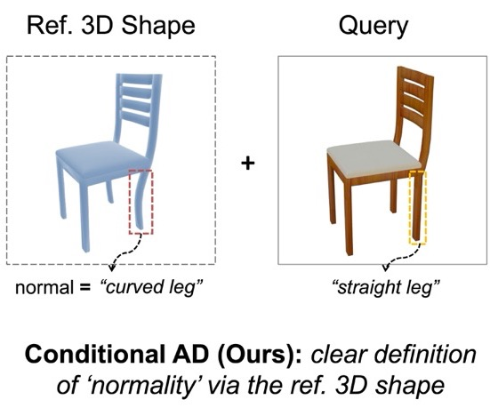

# Looking 3D: Anomaly Detection with 2D-3D Alignment

<table>
  <tr>
      <strong><a href="https://openaccess.thecvf.com/content/CVPR2024/papers/Bhunia_Looking_3D_Anomaly_Detection_with_2D-3D_Alignment_CVPR_2024_paper.pdf">Looking 3D: Anomaly Detection with 2D-3D Alignment</a></strong><br>
      Ankan Bhunia, Changjian Li, Hakan Bilen<br>
      CVPR 2024
  </tr>
</table>

[](https://groups.inf.ed.ac.uk/vico/research/Looking3D)
[](https://openaccess.thecvf.com/content/CVPR2024/papers/Bhunia_Looking_3D_Anomaly_Detection_with_2D-3D_Alignment_CVPR_2024_paper.pdf)
[](https://huggingface.co/datasets/ankankbhunia/brokenchairs180k/tree/main)


<hr />

## News

26/07/2024 - Had some issues with the dataset links. Now the data is hosted in huggingface. 

## Dataset

- The `BrokenChairs180K` dataset is available for download from [here](https://huggingface.co/datasets/ankankbhunia/brokenchairs180k/tree/main).
- The dataset contains around 180K rendered images with 100K classified as anomaly and 80K normal.
- Each rendered query image is associated with a normal shape reference.
- Different types of abnormalities include: missing parts, broken parts, swapped components, mis-alignments.
- The query pose is unknown.
- Testing is performed on previously unseen instances.


<table>
  <tr>
    <td><b>filename and download link</b></td>
    <td><b>folder structure</b></td>
    <td><b>size (after extracting)</b></td>
    <td><b>comments</b></td>
  </tr>
      <tr>
    <td><a href="https://huggingface.co/datasets/ankankbhunia/brokenchairs180k/resolve/main/images.zip">images.zip</a></td>
    <td>BrokenChairs/images/</td>
    <td>21 GB</td>
    <td>[1] (see below)</td>
  </tr>
    <tr>
    <td><a href="https://huggingface.co/datasets/ankankbhunia/brokenchairs180k/resolve/main/annotations.zip">annotations.zip</a></td>
    <td>BrokenChairs/annotations/</td>
    <td>2 GB</td>
      <td>[2] (see below)</td>
  </tr>
      <tr>
    <td><a href="https://huggingface.co/datasets/ankankbhunia/brokenchairs180k/resolve/main/shapes.zip">shapes.zip</a></td>
    <td>BrokenChairs/shapes/</td>
    <td>14 GB</td>
        <td>[3] (see below)</td>
  </tr>
    <tr>
    <td><a href="https://huggingface.co/datasets/ankankbhunia/brokenchairs180k/resolve/main/split.json">split.json</a></td>
    <td>BrokenChairs/split.json</td>
      <td>134 KB</td>
      <td>[4] (see below)</td>
  </tr>
</table>

Note:

[1]`BrokenChairs/images/`: The filenames for the images have a specifc structure. For example in the file with name `render_183_1944_2.5_300_30_3_normal.png`, `183` is the `shape_id`, `1944` is the `texture_id`, `2.5_300_30_3` contains info on camera paramters (in the format of `<radius>_<azim>_<elev>_<light-index>`).

[2]`BrokenChairs/annotations/`:`<info_*>`: It contains 2d_bbox, IoU, camera_parameters and texture_id.
`<mask_new_*>`: binary mask of the object part with the anomaly.
`<mask_old_*>`: binary mask of the object part without the anomaly (normal).
`<mask_new_*>`: segmentation mask of the chair with the anomaly.
`<mask_old_*>`: segmentation mask of the chair without the anomaly (normal).

Annotations are available for anomaly images only. For some anomaly types like missing component, ```<mask_old_*>``` is not available. 

[3]`BrokenChairs/shapes/`: `<mv_images/*.png>`: grayscale multi-view image,
`<mv_images/*.json>`: json file containing intristic and extrinsic parameters of the rendered image,
`<mv_images/*.npy>`: npy file containing 2D-3D correspondence points.
`<model_id.txt>`: corresponding ShapeNet id.

Please refer to `utils/render_multiview.py` which can be used to obtain the above `<png/json/npy>` files from any given `obj/stl/glb` mesh shape.

[4]`BrokenChairs/split.json`: train/test/val split. Each set has mutually exclusive shape instances.

- Distribution of anomaly types within our dataset, categorized by salient chair parts, is shown below.


## More on the proposed novel task & why it is relevent

Standard Anomaly Detection (AD) frameworks perform pooly without clear defination of ‘normality’, especially when abnormalities are arbitrary and instance-specific. Our paper introduces a novel conditional AD task, along with a new benchmark and an effective solution, that aims to identify and localize anomalies from a photo of an object instance (i.e., the query image), in relation to a reference 3D model. The 3D model provides the reference shape for the regular object instance, and hence a clear definition of regularity for the query image. This setting is motivated by real-world applications in inspection and quality control, where an object instance is manufactured based on a reference 3D model, which can then be used to identify anomalies (i.e., production faults, damages) from a photo of the instance.

<table>
  <tr>
    <td style="text-align: center;">
      
    </td>
    <td style="text-align: center;">
      
    </td>
  </tr>
</table>

## Pretrained Models

- Download the pretrained model from [here](https://huggingface.co/datasets/ankankbhunia/brokenchairs180k/resolve/main/model.pt) and place the .pt file inside `experiments/CMT-final/checkpoints/`

## Conda Installation

```bash {"id":"01J22BGWJ0NA4YERREQJ5X2GFT"}
# Create a conda virtual environment for basic training/testing: 
conda create -n Looking3D python=3.8
conda activate Looking3D
pip install opencv-python wandb tqdm albumentations einops h5py kornia bounding_box matplotlib omegaconf trimesh[all] xformers

# install pyrender and pytorch3d (optional; only required for rendering multiview images)
pip install pyrender
pip install fvcore iopath
pip install "git+https://github.com/facebookresearch/pytorch3d.git"
```

## Training and Evaluation on BrokenChairs-180K

Please see [`EXPERIMENT.md`](https://github.com/VICO-UoE/Looking3D/blob/main/EXPERIMENT.md) for commands to run the training and testing codes.

## Inference

You can use the python function `predict(.)` in the `demo.py` file for the inference.

```python {"id":"01J22BGWJ0NA4YERREQMHVP99N"}
from demo import predict

pred_labels = predict(query_path = "sample/query_example.png", \
                     mv_path = "sample/mv_images/", \
                     resume_ckpt = "experiments/CMT-final/checkpoints/model.pt", device = "cuda", topk = 100)
```

## Testing using custom data

```bash {"id":"01J22GFZ30MRZK4VEANC2SV04S"}
# Step 1. Render grayscale multiview images (pytorch3d and pyrender required)
python utils/render_multiview.py \
  --obj_path data/mesh_reference.glb \
  --out_path data/itw_testing/sample/mv_images/ \
  --num_imgs 20 \
  --gray_scale
```

```bash {"id":"01J22GFZ30MRZK4VEANCCZK82W"}
# Step 2. Test the model
python demo.py --mv_path data/itw_testing/sample/mv_images/ \
  --query_path data/query_example.png \
  --resume_ckpt experiments/CMT-final/checkpoints/model.pt
```

## Citation

If you use the results and code for your research, please cite our paper:

```
@article{bhunia2024look3d,
  title={Looking 3D: Anomaly Detection with 2D-3D Alignment},
  author={Bhunia, Ankan Kumar and Li, Changjian and Bilen, Hakan},
  journal={CVPR},
  year={2024}
}
```
